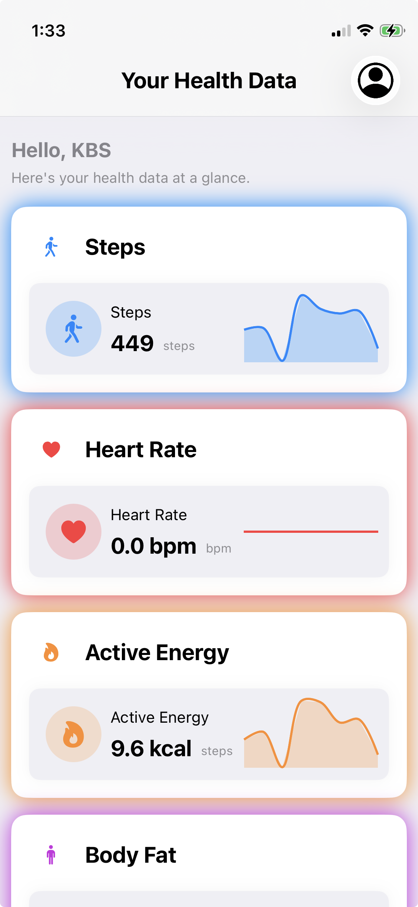

# Health_kbs
HealthObserver – SwiftUI HealthKit Background Sync  A production-ready SwiftUI sample app demonstrating how to observe HealthKit data changes, handle background delivery using HKObserverQuery, and securely upload health metrics to a backend server with BGTaskScheduler.
# HealthObserver – SwiftUI HealthKit Background Sync

HealthObserver is a SwiftUI iOS application that demonstrates how to observe HealthKit data changes in the background and upload health metrics securely to a backend server using `HKObserverQuery`, Background Tasks, and `URLSession` background uploads.

This project is designed as a reference implementation for developers building medical, fitness, or AI-health applications.

---

## 🚀 Features

* SwiftUI based modern architecture
* HealthKit authorization & permissions handling
* Background HealthKit delivery using `HKObserverQuery`
* Background task scheduling using `BGTaskScheduler`
* Secure background upload with `URLSessionConfiguration.background`
* Real-time detection of:

  * Steps
  * Heart Rate
  * Active Energy Burned
  * Body Fat %
  * Weight
  * Height
  * HRV
  * Resting Heart Rate
* Handles locked-device limitations gracefully
* Clean MVVM structure

---

## 🛠 Requirements

* iOS 16+
* Xcode 15+
* Apple Developer Account (HealthKit entitlement required)
* HealthKit & Background Modes enabled

---

## 🔐 Capabilities Setup

Enable the following in Xcode:

| Capability                        | Required              |
| --------------------------------- | --------------------- |
| HealthKit                         | ✅                     |
| Clinical Health Records           | ✅ (optional, for EHR) |
| Background Modes → Health updates | ✅                     |
| Background Tasks                  | ✅                     |
| App Groups                        | Optional              |

---

## 📦 Installation

1. Clone the repository:

```bash
git clone https://github.com/shailendra-kindlebit//HealthObserver.git
cd HealthObserver
```

2. Open the project in Xcode.
3. Change the **Bundle Identifier**.
4. Enable HealthKit & Background capabilities.
5. Run on a real device (HealthKit does NOT work on simulator).

---

## ⚙️ Background Sync Architecture

```text
HealthKit Data Update
        ↓
HKObserverQuery Triggered
        ↓
BGTaskScheduler wakes app
        ↓
Fetch latest Health data
        ↓
Create JSON payload
        ↓
Background URLSession Upload
```

---

## 🧠 How Background Upload Works

* App registers `HKObserverQuery` for required HealthKit types.
* iOS wakes the app when new Health data is added.
* A `BGProcessingTask` is scheduled.
* App fetches the latest sample and uploads it to server.
* Upload continues even if app is suspended or phone is locked.

---

## 📡 Sample Upload Payload

```json
{
  "id": "F3A9C9C3-1D3C-42E7-8F8E-4A2F5A83D2E9",
  "type": "HKQuantityTypeIdentifierHeartRate",
  "value": 72,
  "unit": "count/min",
  "source": "Apple Watch",
  "timestamp": 1704789200
}
```
# HealthObserver

## App Preview



## ⚠️ Limitations

* Health data is encrypted when the device is locked.
* Background execution time is limited by iOS.
* Requires user permission and cannot bypass Apple privacy rules.

---

## 📄 License

MIT License — feel free to use this project in your own applications.

---

## 👨‍💻 Author

Shailendra Kumar Yadav
Senior Mobile App Developer – iOS / Flutter 
8+ years experience in mobile application development.

---

⭐ If you find this useful, please star the repository!
